# AI Code Review Agent - Architecture Diagrams

## System Architecture

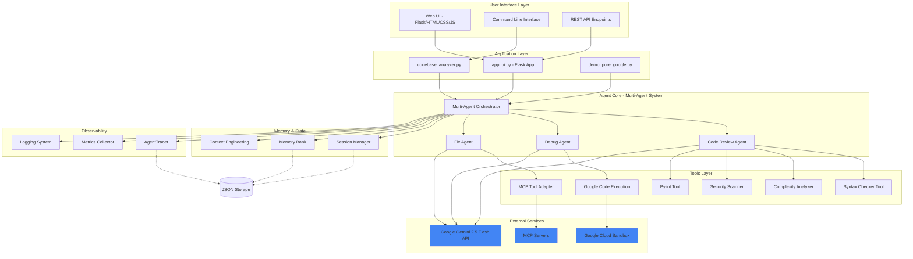

## Multi-Agent Workflow

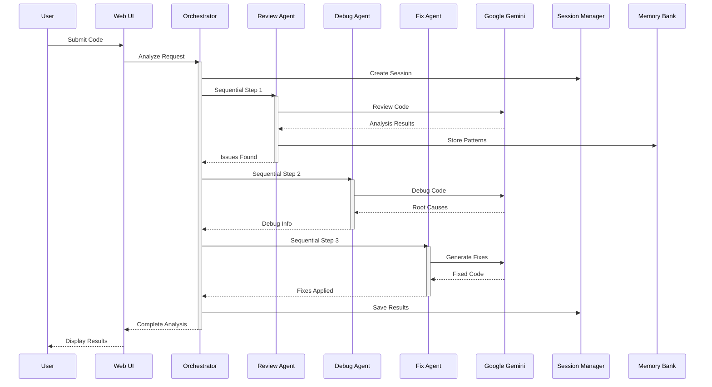

## Data Flow - Single File Analysis

```mermaid
flowchart LR
    A[User Pastes Code] --> B[Language Detection]
    B --> C[Code Validation]
    C --> D{Valid?}
    D -->|No| E[Show Error]
    D -->|Yes| F[Create Session]
    
    F --> G[Start Trace]
    G --> H[Syntax Check]
    H --> I[Security Scan]
    I --> J[Complexity Analysis]
    J --> K[Gemini Review]
    
    K --> L[Parse Results]
    L --> M[Store in Memory]
    M --> N[End Trace]
    N --> O[Record Metrics]
    O --> P[Display Results]
    
    P --> Q[Save Session]
    Q --> R[Generate Report]
    
    style K fill:#4285F4
    style M fill:#90EE90
    style O fill:#FFD700
```

## Data Flow - Codebase Analysis

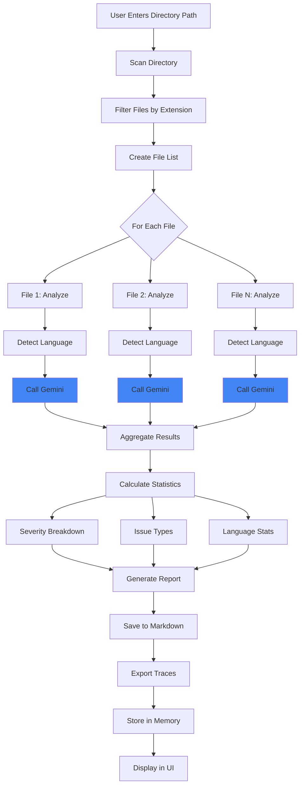

## Component Architecture

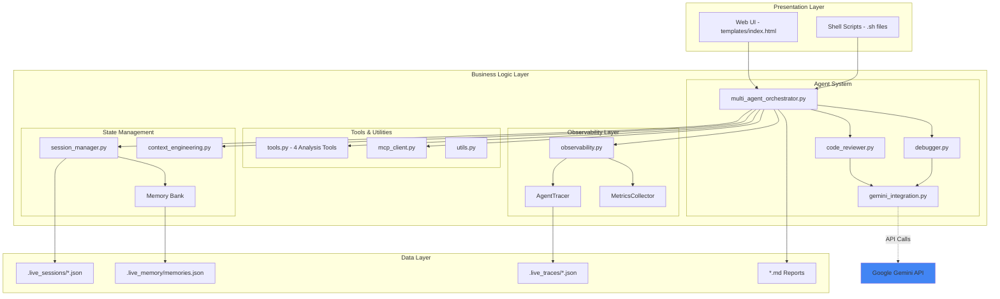

## Session & Memory Flow

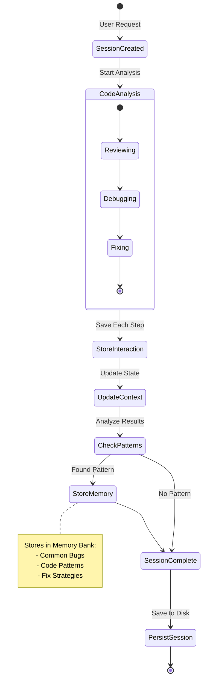

## Observability Flow

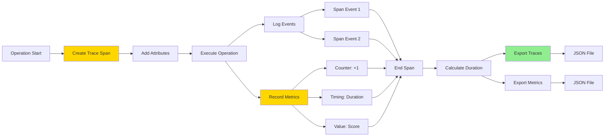

## Deployment Architecture

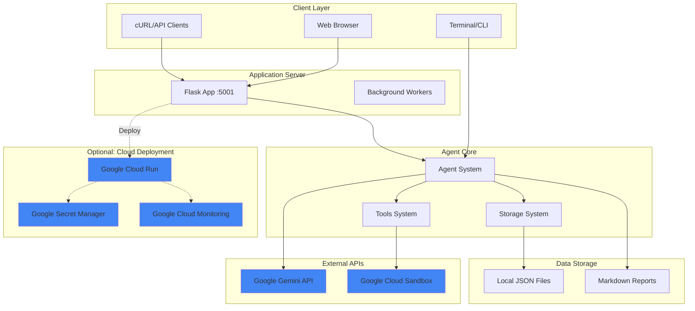

## Technology Stack

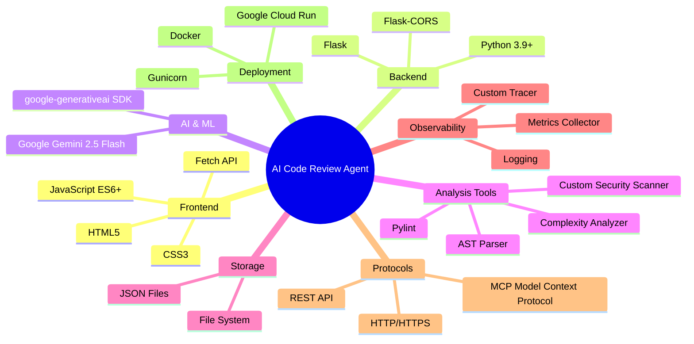

## Request Processing Flow

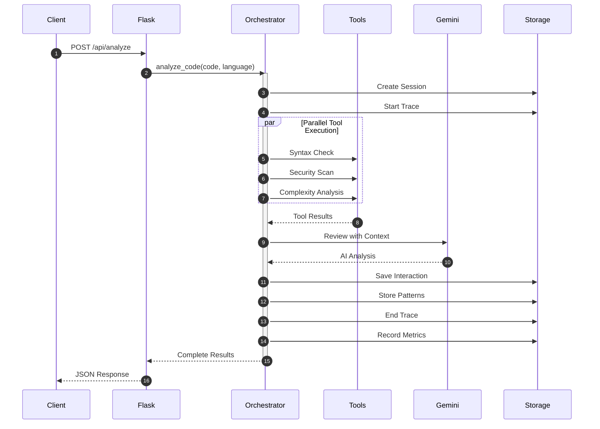

## File Structure

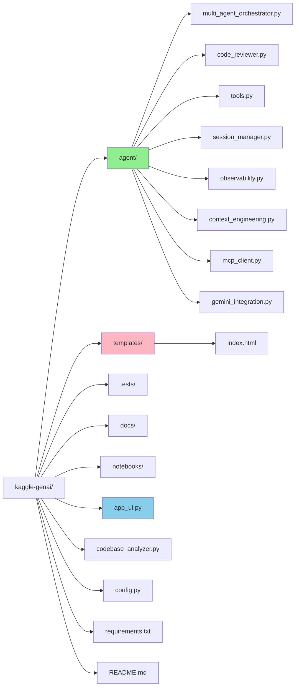

